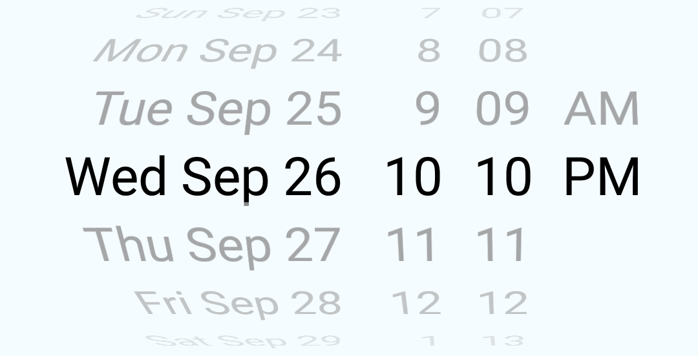

Note: this is a heavily modified fork, the original can be found [here](https://github.com/ElekenAgency/ReactNativeWheelPicker) 

# @delightfulstudio/react-native-wheel-picker-android
[](https://npmjs.org/package/@delightfulstudio/react-native-wheel-picker-android "View this project on npm")
[](https://npmjs.org/package/@delightfulstudio/react-native-wheel-picker-android "View this project on npm")

This package is for Android only.

The package provides WheelPicker based on https://github.com/AigeStudio/WheelPicker and DatePicker built on top of it.
DatePicker has props mostly compatible with DatePickerIOS and can be used as its Android counterpart.    
 
For IOS you can use standard [PickerIOS](https://facebook.github.io/react-native/docs/pickerios.html)
and [DatePickerIOS](https://facebook.github.io/react-native/docs/datepickerios.html).

## Installation Android
`yarn add @delightfulstudio/react-native-wheel-picker-android`

## Auto linking

Doesn't work with react native v0.55 is not tested with in v0.56 

`react-native link @delightfulstudio/react-native-wheel-picker-android`

## Manual linking
Open `android/settings.gradle` and add the following two lines right above `include ':app'`:
```
include ':react-native-wheel-picker-android'
project(':react-native-wheel-picker-android').projectDir = new File(rootProject.projectDir, '../node_modules/@delightfulstudio/react-native-wheel-picker-android/android')
```
Open `android/app/build.gradle` and add the following line to `dependencies` section: 
```
compile project(':react-native-wheel-picker-android')
```
Open `android/app/java/com/{your package name}/MainApplication.java` and add the following line right below `package com.{your package name}`

``` 
import com.delightfulstudio.wheelpicker.WheelPickerPackage;
```
In the same file find method `getPackages()` and add `new WheelPickerPackage()` at the end of the returned array, like this:
```
    @Override
    protected List<ReactPackage> getPackages() {
      return Arrays.<ReactPackage>asList(
          new MainReactPackage(),
          new WheelPickerPackage() // << add this
      );
    }
``` 

 

# Usage

```js

import { WheelPicker, DatePicker } from '@delightfulstudio/react-native-wheel-picker-android'
import React, { Component } from 'react';
import {
    StyleSheet,
    View
} from 'react-native';

const wheelPickerData = ['Sunday', 'Monday', 'Tuesday', 'Wednesday', 'Thursday', 'Friday','Saturday'];
const now = new Date()

const styles = StyleSheet.create({
    container: {
        flex: 1,
        alignItems: 'center',
    },
    wheelPicker: {
        width: 200,
        height: 150
    }
});

export default class MyPickers extends Component {
    render() {
        return (
            <View style={ styles.container }>
                <WheelPicker
                    onItemSelected={ this.onItemSelected }
                    isCurved
                    data={ wheelPickerData }
                    visibleItemCount={5}
                    style={ styles.wheelPicker }/>
                <DatePicker
                    date={ now }
                    mode="datetime"
                    onDateChange={ this.onDateSelected }/>
                <DatePicker
                    date={ now }
                    mode="time"
                    onDateChange={ this.onTimeSelected }/>
            </View>
        );
    }

    onItemSelected = event => {
        // do something
    };

    onDateSelected = date => {
        // do something
    };

    onTimeSelected = date =>{
        // do something
    };
}
```

To check out working example:
 1. clone [repo](https://github.com/DelightfulStudio/react-native-wheel-picker-android)
 2. Install root packages: `yarn` or `npm install`
 3. Install example packages: in the `example` folder, do `yarn` or `npm install`
 4. Start metro server: in the `example` folder, do `yarn start` or `npm start`
 5. Compile/start Android app: in the `example` folder, do `yarn run-android` or `npm run-android`


## Wheel Picker


```js

import { WheelPicker, DatePicker, TimePicker } from '@delightfulstudio/react-native-wheel-picker-android'
...

    render() {
        const arr = [1,2,3];
        return (
        <WheelPicker
            onItemSelected={ event => {/* do something */} }
            isCurved
            isCyclic
            data={arr}
            style={{width:300, height: 300}}/>
        );
  }
```

## Props

| Prop  | Default  | Type | Description |
| :--- |:---:| :---:| :--- |
| onItemSelected | null | `func` | Callback when user select item {data: 'itemData', position: 'itemPosition'} |
| data | default string array | `array` | Data array (string or number type)  |
| isCurved | false | `bool` | Make Wheel Picker curved |
| isCyclic | false | `bool` | Make Wheel Picker cyclic |
| isAtmospheric | false | `bool` | Design Wheel Picker's items  |
| selectedItemTextColor | grey | `string` | Wheel Picker's selected Item Text Color  |
| itemSpace | 20 | `number` | Wheel Picker's items spacing |
| visibleItemCount | 7 | `number` | Wheel Picker's items max visible count  |
| renderIndicator | false | `bool` | Show Wheel Picker indicator |
| indicatorColor | transparent | `string` | Indicator color  |
| isCurtain | false | `bool` | Wheel Picker curtain  |
| curtainColor | transparent | `string` | Wheel Picker curtain color  |
| itemTextColor | grey | `string` | Wheel Picker's items color  |
| itemTextSize | 20 | `number` |  Wheel Picker's items text size  |
| itemTextFontFamily | null | `string` | Wheel Picker's items text font name  |
| itemTextAlign | 'center' | enum('left', 'center', 'right') | Wheel Picker's items text alignment |
| selectedItemPosition | null | `number` | Select current item position |
| backgroundColor | transparent | `string` | Wheel Picker background color  |

### data

An array of options. This should be provided with an __array of strings__ or __array of numbers__.


### onItemSelected(event)

Callback with event in the form `event = { data: 1, position: 0 }`


## Date Picker



```js

...

  render() {
  let now = new Date();
    return (
        <DatePicker
            date={ now }
            mode="datetime"
            onDateChange={ this.onDateSelected }/>
    );
  }

  onDateSelected = date => {
    // do something
  };

```

## Props

| Prop | Required | Default | Type | DatePickerIOS | Description |
| :--- | :---: | :---: | :---: | :---: | :--- |
| date | [] | now | `Date` | [x] | The currently selected date | 
| onDateChange | [x] | null | `func` | [x] | Date change handler |
| minimumDate | [] | `maximumDate - 1 year` or `date` | `Date` | [x] | Minimum date - restricts the range of possible date/time values | 
| maximumDate | [] | `minimumDate + 1 year` | `Date` | [x] | Maximum date - restricts the range of possible date/time values |
| minuteInterval | [] | 1 | `enum(1, 2, 3, 4, 5, 6, 10, 12, 15, 20, 30)` | [x] | The interval at which minutes can be selected |
| mode* | [] | 'date' | `enum('date', 'time', 'datetime')` | [x] | The date picker mode |
| locale** | [] | | [Locale ID](https://developer.apple.com/library/archive/documentation/MacOSX/Conceptual/BPInternational/LanguageandLocaleIDs/LanguageandLocaleIDs.html) | [x] | The locale for the date picker | 
| styles | [] | | `{ picker?: {}, date?: {}, hours?: {}, minutes?: {}, gap?: {}, AM?: {} }` | [] | The control styles - allows to adjust control layout |
| todayTitle | [] | 'Today' | `string` | [] | The title for today date item |   

\* `mode: 'date'` doesn't allow to select day, month and year separately one from another and therefor is not suitable for selection in a large range of dates, ex: birthdays.

\*\* `locale: {locale id}` support is limited to 12/24 mode and names of months and days, it also requires explicit `import 'moment/locale/{locale id}'` somewhere in your script for any non-english locales to work properly.  

## Questions or suggestions?

Feel free to [open an issue](https://github.com/DelightfulStudio/react-native-wheel-picker-android/issues)
